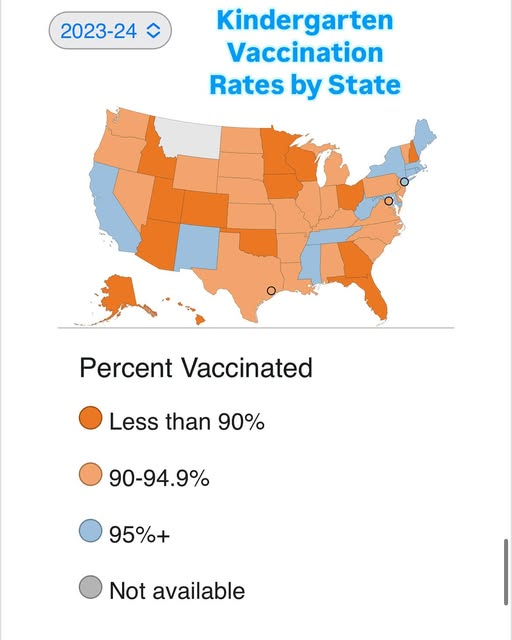

<!-- README.md is generated from README.Rmd. Please edit that file -->

```{r, include = FALSE}
knitr::opts_chunk$set(
  collapse = TRUE,
  comment = "#>"
)
```

# Texas Measles Outbreak 2025

<!-- badges: start -->

<!-- badges: end -->

On 30 January 2025, Texas' South Plains Public Health District alerted the public to two confirmed cases of measles in residents of Gaines County. ^[<https://southplainshealth.org/wp-content/uploads/2025/01/second-case-2025-01-31.pdf>] This outbreak reached nine confirmed case by midday 7 February with ARS Technica reporting that Gaines County ranks near the bottom of Texas' counties with only 82 percent of the kindergartens in public schools being up to date on their vaccinations.^[<https://arstechnica.com/health/2025/02/measles-outbreak-erupts-in-one-of-texas-least-vaccinated-counties>] This outbreak quickly gained international attention with the Times of India reporting that 24 measles cases, 22 of them in children, had been confirmed as of 11 February.^[<https://timesofindia.indiatimes.com/life-style/health-fitness/health-news/24-cases-of-measles-outbreak-reported-in-a-small-county-in-texas/articleshow/118225827.cms>] By 14 February, the cases had doubled to 48.^[<https://edition.cnn.com/2025/02/14/health/measles-texas-outbreak>] The next day, the Houston Chronicle reported that the outbreak had spread through Texas with 200-300 Texans feared infected.^[<https://www.chron.com/news/houston-texas/article/measles-vaccine-vaccinations-outbreak-texas-20169162.php>]

But Texas is hardly the worst of the states when it comes to vaccinating its children. A map of kindergarden vaccination rates by state^[<https://www.instagram.com/epidemiologistkat/p/DCW6zRaR_pk/>] shows at least 14 states with rates lower than Texas, including my home state of Minnesota.

```{r pressure, echo=FALSE, fig.cap="Kindergarden vaccination rates by state, 2023-24", out.width = '50%'}

```


