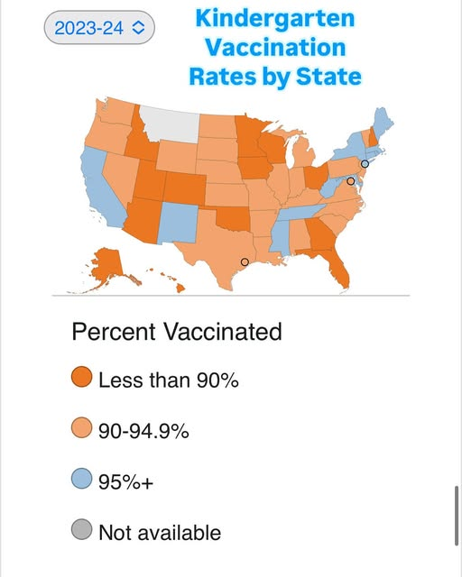

<!-- README.md is generated from README.Rmd. Please edit that file -->

# Texas Measles Outbreak 2025

<!-- badges: start -->

<!-- badges: end -->

On 30 January 2025, Texas’ South Plains Public Health District alerted
the public to two confirmed cases of measles in residents of Gaines
County. [^1] This outbreak reached nine confirmed case by midday 7
February with ARS Technica reporting that Gaines County ranks near the
bottom of Texas’ counties with only 82 percent of the kindergartens in
public schools being up to date on their vaccinations.[^2] This outbreak
quickly gained international attention with the Times of India reporting
that 24 measles cases, 22 of them in children, had been confirmed as of
11 February.[^3] By 14 February, the cases had doubled to 48.[^4] The
next day, the Houston Chronicle reported that the outbreak had spread
through Texas with 200-300 Texans feared infected.[^5]

But Texas is hardly the worst of the states when it comes to vaccinating
its children. A map of kindergarden vaccination rates by state[^6] shows
at least 14 states with rates lower than Texas, including my home state
of Minnesota.

Kindergarden vaccination rates by state, 2023-24

[^1]: <https://southplainshealth.org/wp-content/uploads/2025/01/second-case-2025-01-31.pdf>

[^2]: <https://arstechnica.com/health/2025/02/measles-outbreak-erupts-in-one-of-texas-least-vaccinated-counties>

[^3]: <https://timesofindia.indiatimes.com/life-style/health-fitness/health-news/24-cases-of-measles-outbreak-reported-in-a-small-county-in-texas/articleshow/118225827.cms>

[^4]: <https://edition.cnn.com/2025/02/14/health/measles-texas-outbreak>

[^5]: <https://www.chron.com/news/houston-texas/article/measles-vaccine-vaccinations-outbreak-texas-20169162.php>

[^6]: <https://www.instagram.com/epidemiologistkat/p/DCW6zRaR_pk/>
